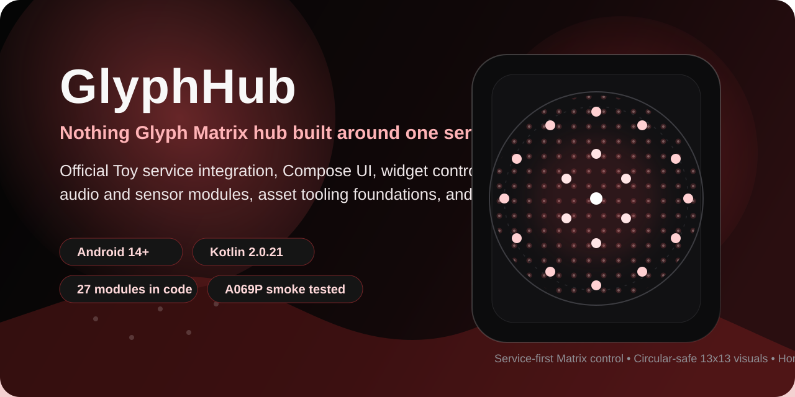
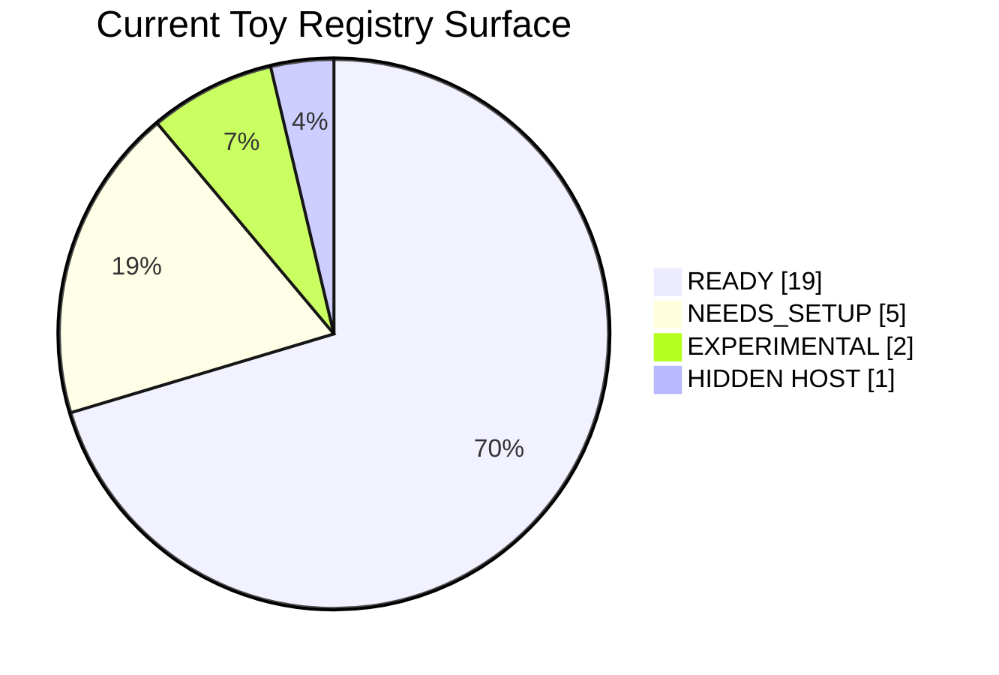
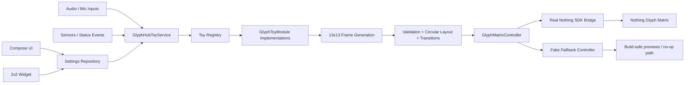

<p align="center">
  
</p>

<h1 align="center">GlyphHub</h1>

<p align="center">
  <strong>I’m building a service-first Glyph Matrix hub for Nothing phones.</strong>
</p>

<p align="center">
  One app, one official Toy service, one shared 13x13 rendering pipeline, and a growing catalog of matrix-native tools, utilities, and playful modules.
</p>

<p align="center">
  
  
  
  
  
</p>

## Why I built it

I wanted one place where the official Nothing Glyph Toy integration, widget control, per-Toy settings, animation tooling, and experimental ideas could live together without fragmenting the render pipeline. GlyphHub is intentionally architected so the app UI, widget, sensors, status listeners, and future web tools do not write to the Matrix directly. Everything flows through one service-owned path.

That design choice is the center of the project: I would rather ship one honest, debuggable renderer than a pile of shortcuts that fight the Nothing runtime.

## Current Public Status

> The build/install/launch baseline is clean on Nothing Phone (4a) Pro (`A069P`). The official `com.nothing.glyph.TOY` service path is implemented, the real SDK bridge works, the fake fallback still compiles without the AAR, and the widget/app surface is already broad. The biggest remaining gap is no longer raw implementation. It is final hardware quality: physical LED readability, AOD behavior, longer device soak, and finishing the editor/import/export workflow.

## Registry Surface



I currently ship 27 registered modules in code, but I do not present all 27 as equally finished. The visibility model is deliberate:

| Tier | Count | What I mean by it |
| --- | ---: | --- |
| `READY` | 19 | Visible in the app and broadly usable, even if some still need hardware polish. |
| `NEEDS_SETUP` | 5 | Functionality exists, but it depends on permissions, network, microphone, or setup truth I do not want to fake. |
| `EXPERIMENTAL` | 2 | Intentionally kept behind a caution line until physical Matrix behavior is validated. |
| `HIDDEN` | 1 | Internal host/default-display module, not a public Toy card. |

## What Already Works

| Area | Status | Notes |
| --- | --- | --- |
| Service-owned render pipeline | Strong | `GlyphHubToyService` owns activation, transitions, render sessions, sensors, and widget sync. |
| Real SDK bridge + fake fallback | Strong | Reflection-based real bridge is wired; the project still compiles when the Nothing AAR is absent. |
| App UI | Strong | Compose screens exist for Home, Toy Grid, Toy Settings, App Settings, Default Display, and Debug. |
| Widget | Usable | The 2x2 widget, centered preview, and five-tap-zone flow are implemented and revalidated on device. |
| Matrix design system | Strong | Shared 13x13 circular layout, frame validation, text rendering, and transition engine are in place. |
| Module catalog | Broad but uneven | The registry spans core utilities, sensors, audio, status tools, and playful Toys. |
| Automated tests | Thin | Build and device smoke evidence is strong; broader automated lifecycle/render tests are still missing. |

## Module Catalog

| Tier | Modules |
| --- | --- |
| `READY` | Battery, Clock, Dice, Coin, Timer, Pomodoro, Level, Lux Meter, Compass, Orientation, Metronome, Eye, Breath, Sun / Moon, School Class Timer, Network Status, Beacon, Pixel Art, Text Scroll |
| `NEEDS_SETUP` | Motion, Tuner, Sound Meter, Weather, Payment |
| `EXPERIMENTAL` | Rock Paper Scissors, Maze |
| `HIDDEN HOST` | Idle / Default Display |

That breadth is real, but I keep the README honest: several modules are already useful while still needing final visual tuning on the actual phone back.

## Architecture At A Glance



The technical version of this architecture lives in [docs/TECHNICAL_README.md](docs/TECHNICAL_README.md) and [docs/ARCHITECTURE.md](docs/ARCHITECTURE.md).

## Quick Start

### Prerequisites

- Android SDK Platform 34
- JDK 17+
- `adb` in PATH or reachable through the Android SDK
- A Nothing device authorized for USB debugging

### Build And Run

```powershell
.\scripts\device-check.ps1
.\scripts\build-debug.ps1
.\scripts\install-debug.ps1 -Serial YOUR_ADB_SERIAL
.\scripts\launch-app.ps1 -Serial YOUR_ADB_SERIAL
```

### Smoke Test

```powershell
.\scripts\smoke-test-device.ps1 -Serial YOUR_ADB_SERIAL
.\scripts\logcat-glyphhub.ps1 -Serial YOUR_ADB_SERIAL
```

VS Code tasks are already configured for build, install, device check, launch, logcat, and smoke validation.

## Proof Instead Of Promises

I am treating this as a product repo, not as a loose concept dump. The current evidence base already includes:

- clean `assembleDebug` and `:app:compileDebugKotlin`
- successful debug install and launch on Nothing `A069P`
- filtered logcat without immediate `FATAL EXCEPTION` during smoke passes
- real Glyph SDK registration and 13x13 target detection in log output
- widget tap-zone retests for previous, next, toy settings, toggle, and app settings
- a compile-time fallback pass with the Nothing SDK AAR temporarily removed

What is still open is equally explicit:

- final phone-back visual judgment for readability and flicker quality
- AOD / Nothing system settings validation end to end
- longer runtime soak with repeated Toy switching
- richer import/export UX and broader automated tests

## Documentation Map

- [docs/TECHNICAL_README.md](docs/TECHNICAL_README.md): engineering-facing technical overview
- [docs/ARCHITECTURE.md](docs/ARCHITECTURE.md): service, widget, controller, and lifecycle design
- [docs/IMPLEMENTATION_STATUS.md](docs/IMPLEMENTATION_STATUS.md): tracked implementation state and next actions
- [docs/PHONE_TEST_RESULTS.md](docs/PHONE_TEST_RESULTS.md): build, install, smoke, and widget/device evidence
- [docs/TESTING.md](docs/TESTING.md): reproducible build and device workflow
- [docs/TODO.md](docs/TODO.md): active backlog

## Public Note

This is an independent project targeting the Nothing Glyph Matrix Toy ecosystem. I describe the current state as it is: substantial, usable, and already validated in important places, but not finished pretending to be finished.
## License

MIT, see [LICENSE](LICENSE). Adapted third-party sources and their licenses are listed in [docs/THIRD_PARTY_NOTICES.md](docs/THIRD_PARTY_NOTICES.md). The Nothing Glyph Matrix SDK AAR is not part of this repository and is covered by its own terms.

---

Autor: [Jiří Pelikán](https://jirkapelikan.cz/projekty/glyphhub/) · [jirkapelikan.cz](https://jirkapelikan.cz)
