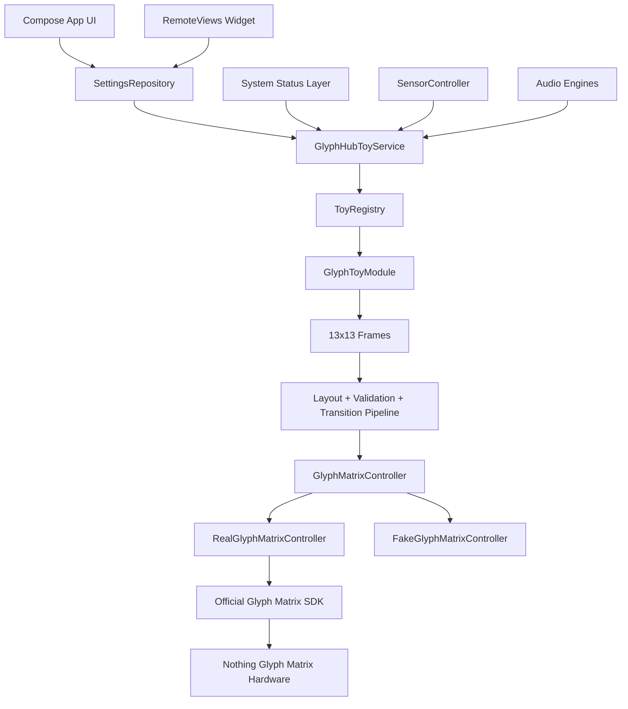
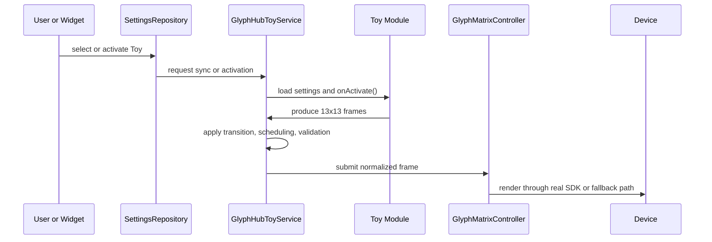

# GlyphHub Technical README

I designed GlyphHub around one rule: the Matrix belongs to the service, not to the UI. That rule drives the architecture, the testing approach, and the honesty of the current project status.

## Engineering Snapshot

| Axis | Current implementation |
| --- | --- |
| Platform | Android, `minSdk = 33`, `targetSdk = 34`, `compileSdk = 34` |
| Language and UI | Kotlin `2.0.21`, Jetpack Compose, Material 3 |
| Device target | Nothing Phone (4a) Pro (`A069P`) with a 13x13 Glyph Matrix |
| Integration contract | Official `com.nothing.glyph.TOY` service path |
| Runtime ownership | `GlyphHubToyService` owns Matrix output, transitions, and active sessions |
| SDK strategy | Reflection-based real bridge plus fake compile-safe fallback |
| Network and local tooling | OkHttp `4.12.0`, NanoHTTPD `2.3.1` |
| Audio features | `AudioRecord` pipeline, YIN pitch detection, RMS/dB approximation |

## System Intent

I am not trying to let every surface talk to the hardware independently. I want one controlled output path with one scheduler, one validation layer, and one place where service lifecycle and Nothing integration stay observable.

That produces three practical benefits:

1. The widget, app UI, sensors, status listeners, and future web tooling stay simpler because they only request state changes.
2. Render quality work lives in one place, which is how I can enforce the no-flash policy, circular layout constraints, and frame validation consistently.
3. The Nothing runtime is less likely to fight the app, because the codebase does not scatter Matrix writes across unrelated components.

## High-Level Architecture



## Activation Flow



Selection-only changes stay lighter than full activation. They update the chosen Toy and widget state without replaying activation effects for a Toy that is already active.

## Core Subsystems

| Subsystem | Purpose | Current reality |
| --- | --- | --- |
| `glyph/` | Service lifecycle, scheduler, frame types, controller bridge, transitions, validation | This is the core of the app and the most mature layer. |
| `toys/` | Registry, metadata, per-Toy settings schemas, frame generation | Broad module surface exists; polish varies significantly by Toy. |
| `ui/` | Home, grid, per-Toy settings, app settings, default display, debug | Strong surface coverage in Compose. |
| `widget/` | 2x2 widget, centered preview, five tap zones, settings/app routes | Implemented and retested on device. |
| `audio/` | Pitch detection, tracker, microphone input, sound-level measurement | Working code exists; manual microphone validation remains required. |
| `systemstatus/` | Charging, volume, notifications, package lifecycle, event routing | Present, but live behavior still needs more device proof. |
| `weather/` | Open-Meteo client, models, repository, caching | Integrated, setup-gated, and still awaiting broader device/network validation. |
| `web/` | Local portal manager for controlled browser-side tooling | Skeleton exists and compiles; still intentionally partial. |
| `settings/`, `schedule/`, `sensors/` | Persistence, quiet windows, sensor gating and routing | Important support layers, already wired into the main flow. |

## Registry And Maturity

The current registry contains 27 modules:

| Visibility | Count | Modules |
| --- | ---: | --- |
| `READY` | 19 | Battery, Clock, Dice, Coin, Timer, Pomodoro, Level, Lux Meter, Compass, Orientation, Metronome, Eye, Breath, Sun / Moon, School Class Timer, Network Status, Beacon, Pixel Art, Text Scroll |
| `NEEDS_SETUP` | 5 | Motion, Tuner, Sound Meter, Weather, Payment |
| `EXPERIMENTAL` | 2 | Rock Paper Scissors, Maze |
| `HIDDEN` | 1 | Idle / Default Display |

Important nuance: `READY` means I currently surface the Toy in the app and consider it useful. It does not mean I have already signed off every LED pattern, every transition nuance, or every hardware corner case.

## Render And Safety Model

I already have the important safety rails in code:

- a shared 13x13 circular Matrix layout so content targets the physical LED mask instead of a naive square
- a no-flash rendering policy and render scheduler
- a validation and normalization layer before output reaches the Matrix
- centralized transitions rather than Toy-specific ad hoc animation fragments
- a text-rendering subsystem for constrained glyph output
- a real SDK bridge isolated from the UI and widget layers

This is why the project feels more like a platform than a stack of demos.

## Device Validation Baseline

Current documented evidence already includes:

- `:app:compileDebugKotlin` passing across multiple implementation slices
- `assembleDebug` passing with the Nothing SDK AAR present
- `assembleDebug` also passing when the AAR is temporarily removed, proving fake-fallback compile health
- successful debug APK install and app launch on Nothing `A069P`
- filtered logcat showing real SDK mode, service registration, and 13x13 target detection
- physical widget tap validation for previous, next, left settings, center toggle, and right app settings routing

The remaining open validation items are mostly physical and behavioral, not structural:

- phone-back LED readability and flicker judgment
- Always-on Display integration through the Nothing settings flow
- long-run stability while repeatedly switching Toys
- final truthfulness checks for permission-gated and externally dependent modules

## Build And Workflow

### PowerShell scripts

```powershell
.\scripts\device-check.ps1 -Serial YOUR_ADB_SERIAL
.\scripts\build-debug.ps1
.\scripts\install-debug.ps1 -Serial YOUR_ADB_SERIAL
.\scripts\launch-app.ps1 -Serial YOUR_ADB_SERIAL
.\scripts\smoke-test-device.ps1 -Serial YOUR_ADB_SERIAL
.\scripts\logcat-glyphhub.ps1 -Serial YOUR_ADB_SERIAL
```

### Key build facts

- the app depends on the official Glyph Matrix SDK AAR through `app/libs`
- the real controller uses reflection so the project can still compile without the AAR present
- debug Activity intent commands exist for activation, deactivation, sync, transition tests, and widget refresh

## What Is Solid Vs What Is Still Moving

| Area | Solid already | Still moving |
| --- | --- | --- |
| Build and packaging | Yes | Routine reruns still needed after each feature slice |
| Service-first architecture | Yes | Long-run soak still worth expanding |
| Widget routing | Yes | Launcher-specific UX edge cases may still need follow-up |
| Toy inventory breadth | Yes | Quality and finish vary by module |
| Hardware-dependent features | Partly | Audio, weather, notifications, payment, and status routes need more live evidence |
| Asset/editor workflow | Partly | Import/export UX and persistence need further work |
| Automated tests | No | This remains the most obvious engineering gap |

## Documentation Index

- [ARCHITECTURE.md](ARCHITECTURE.md)
- [IMPLEMENTATION_STATUS.md](IMPLEMENTATION_STATUS.md)
- [PHONE_TEST_RESULTS.md](PHONE_TEST_RESULTS.md)
- [TESTING.md](TESTING.md)
- [APP_COMPLETION_AUDIT.md](APP_COMPLETION_AUDIT.md)
- [TODO.md](TODO.md)

## Closing Position

My current position on GlyphHub is straightforward: the architecture is real, the product surface is already broad, and the public story can be strong because it is backed by evidence. The remaining work is mainly the hard last mile that real hardware projects always have: tuning, validation, and refusing to overclaim readiness before the phone back proves it.